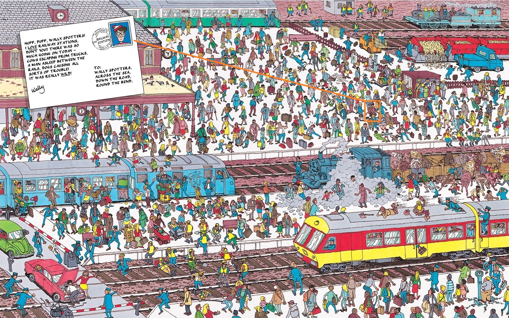
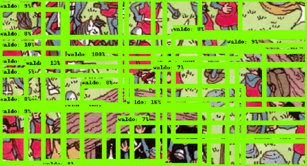
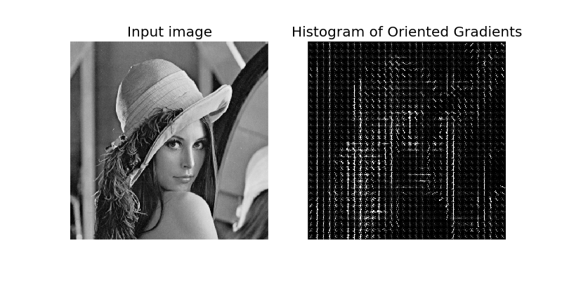

# A Shallow Object Detection Introduction

The goal of this article is originally about to record what I have read and survey about Object detection, and later I found out that it's much better to make it like an beginner-oriented introduction so here it is.

I would try to stay shallow, friendly and organized as much as I can so that it wouldn't freak out beginners or make them lost in terminology and formula.

## Object Detection

Generally speaking, It's a task about to locate certain object and tell what the object is. e.g., [Where's Wally](https://en.wikipedia.org/wiki/Where%27s_Wally%3F). Human can do this effortlessly so that you may not notice how hard this actually could be. Not to mention designing a program / algorithm to do so.

Therefore, we use **Machine Learning**, specially **Neural Network** nowadays, to solve this task. Rather than actually design an algorithm that can detect object, just design an  program that can learn how to detect object.

e.g., Use Neural Network to find out **Where's Wally / Waldo** like [this](https://towardsdatascience.com/how-to-find-wally-neural-network-eddbb20b0b90) and [this](https://github.com/alseambusher/deepwaldo).

If you want to go through the history of Object Detection from the very beginning, go check out Lecture 1 of [Stanford CS231n](http://cs231n.stanford.edu/). It's a very nice course for those who want to study computer vision. However, This course is not designed for beginners, so if you are pretty new to this topic, maybe take a Machine Learning course on MOOC would be much more helpful.

### Terminology

Usually, You will see Object Detection along with several keywords like Machine Learning, Computer Vision, Image Classification, Neural Network, CNN ... and so on. To clarify this, I will list those I've heard of and explain the relationships between them.

Keep in mind that my *shallow* explanation may not be comprehensive enough because every words I'm going to mention could be a topic that would spend you months to study.

- **Machine Learning** is a study about how to design a clever program that can automatically find out how to solve various tasks without human hand-holding.
  - **Classifier**
  - **Training**
- **Computer Vision** is a sub domain of Machine Learning. Its goal is pretty much same with Machine Learning but only focus on the tasks those process image or video.
  - **Image Classification** is a topic / task of Computer Vision whose goal is to find a way to tell what the object on the image is automatically.
  - There are still other tasks like **Image Segmentation**, **Image Captioning** ...
- **Neural Network** is a branch of Machine Learning Classifier algorithm. Due to the increasing of amount of data and computing power, Its performance has already outperform almost every other algorithm in almost every Machine Learning task in recent year. It is said that its origin of the study is about to simulate how neuron works in human brain.
  - **Convolutional Neural Network (CNN)** is one kind of Neural Network structure which is perfect for solving most Computer Vision tasks. The core idea is all about using **convolutional layer** to simulate how human brian process what people see.
- **TensorFlow** is a 

*If you still want more detail, try google search.*

### Overview

I Split this section into 2 parts, One is **Before Neural Network** and another is **Neural Network**. In First part, I will briefly introduce some method which was either common or once state-of-the-art at their time. Then I will introduce **Neural Network** which is actually the reason make me to start writing this in next part.

#### Before Neural Network

As far as I know, Most traditional method around 2006 - 2010 could fit into the **three steps flow**. See the figure below.

To put it simply, this is what actually each steps do:

1. **Region Proposal** - Find those region may potentially contains an object. The most common and easiest method is **sliding window**. Just like the figure shown below, a fixed-size window would slide over entire image and the bounded area would be treated as the proposed regions.

2. **Feature Extraction** - Transform the proposed regions of image into a different kind of representation which is usually defined by human. For example, Histogram of Gradient (HoG) will calculate the gradient between pixels and take is as a representation of image. It was once very popular because its promising performance on object detection.

3. **Classification** - Determine if the proposed area does contain an object according to transformed representation. In this step, we would need a classifier which is trained with transformed representation to achieve this task.If you are interested in it, it is better that taking a Machine Learning course on MOOC site e.g., Coursera or Udacity.

Here is some keywords of traditional method, I only list few because I know very less about them.

1. Region Proposal- Sliding Window
2. Feature Extraction - Haar, HOG, LBP, ACF
3. Classification - SVM, AdaBoost, DPM

#### Neural Network

Generally, NN-based method could be  classified into 2 classes. One is often called as **Two-Stage Detectors** due to the way it approach the task. They first find regions that are potential to be a object over image and then try to tell what kind of object is it. Another is **One-Stage Detectors** which attempt to solve two problems together.

Some also says that the major difference between the two kind is how they approach the problem. Two-Stage Detector try to take Object Detection as a classification problem and One-Stage Detector treat it as a regression problem. Also, the trade-off between accuracy and speed is different, Two-Stage Detectors are usually more accurate and One-Stage Detectors are faster.

Here is the paper list of both kinds detectors. I only list those I've heard of, If I miss something important, remind me please.

- Two-Stage Detectors
  - [R-CNN](https://arxiv.org/abs/1311.2524)
  - [SPP-Net](https://arxiv.org/abs/1406.4729)
  - [Fast R-CNN](https://arxiv.org/abs/1504.08083)
  - [Faster R-CNN](https://arxiv.org/abs/1506.01497)
  - [R-FCN](https://arxiv.org/abs/1605.06409)
  - [Feature Pyramid Networks (FPN)](https://arxiv.org/abs/1612.03144)
  - [Deformable Convolutional Networks](https://arxiv.org/abs/1703.06211)
  - [Mask R-CNN](https://arxiv.org/abs/1703.06870)
  - [RetinaNet](https://arxiv.org/abs/1708.02002)
  - [Light-Head R-CNN](https://arxiv.org/abs/1711.07264)
- One-Stage Detectors
  - [OverFeat](https://arxiv.org/abs/1312.6229)
  - [YOLO](https://arxiv.org/abs/1506.02640)
  - [SSD](https://arxiv.org/abs/1512.02325)
  - [YOLO9000 & v2](https://arxiv.org/abs/1612.08242)
  - [DSSD](https://arxiv.org/abs/1701.06659)
  - [YOLO v3](https://arxiv.org/abs/1804.02767)

Other than Object Detection framework, each method mentioned above also must combine with a **Backbone Network** (some may called it as **Feature Extractor**, just like the role in the three step flow I mention above) to function normally. Different Backbone Network imply different structure, different possible performance and different computing power required. There are a lot of classic neural network structure over the years and here are the most common ones.

- [ResNet](https://arxiv.org/abs/1512.03385)
- [Inception](https://arxiv.org/abs/1409.4842)
- [VGG](https://arxiv.org/abs/1409.1556)
- [MobileNet](https://arxiv.org/abs/1704.04861)

I only link the very origin paper because each structure I mention have various variants. You may see something like ResNet-101, VGG-16, MobileNet v1... and so on. Some suffix just means that it use different parameter but some may actually means significant breakthrough. Just realize that the research about network structure is a very popular research topic so they would get improved all the time.

*****

## Benchmarks / Datasets

- [COCO](http://cocodataset.org)
- Pascal VOC [2007](http://host.robots.ox.ac.uk/pascal/VOC/voc2007/) / [2012](http://host.robots.ox.ac.uk/pascal/VOC/voc2012/)
  <!--- aeroplane, bicycle, bird, boat, bottle, bus, car, chair, cow, diningtable, dog, horse, motorbike, person, pottedplant, sheep, sofa, train, tvmonitor-->
- [ImageNet Det](http://www.image-net.org/challenges/LSVRC/)

